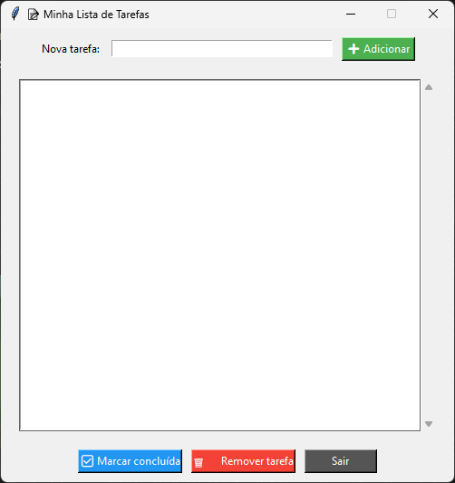
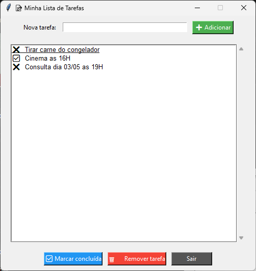

# 📝 Planner To-Do

Um sistema de lista de tarefas desenvolvido em Python para organizar atividades, melhorar produtividade e praticar lógica de programação.

---

# 📌 Sobre o Projeto

O **Planner To-Do** é um projeto simples criado com foco em aprendizado e prática de Python.

O sistema permite:

* adicionar tarefas;
* visualizar tarefas;
* remover tarefas;
* salvar tarefas em arquivos JSON.

Esse projeto foi desenvolvido para praticar:

* lógica de programação;
* estruturas de dados;
* manipulação de listas;
* arquivos JSON;
* loops;
* condicionais;
* organização de projetos.

---

# 🚀 Funcionalidades

✅ Adicionar tarefas
✅ Listar tarefas
✅ Remover tarefas
✅ Salvamento automático em JSON
✅ Interface simples no terminal
✅ Organização prática de atividades

---

# 🛠️ Tecnologias Utilizadas

* Python 3
* JSON

---

# 📂 Estrutura do Projeto

```bash
planner-to-do/
│
├── main.py
├── tarefas.json
├── README.md
└── prints/
    ├── to-do.png
    └── to-do1.png
```

---

# 📸 Prints do Projeto

## Tela principal



---

## Sistema funcionando



---

# ▶️ Como Executar

## 1. Clone o repositório

```bash
git clone https://github.com/iLGuilhermeDev/planner-to-do.git
```

---

## 2. Acesse a pasta

```bash
cd planner-to-do
```

---

## 3. Execute o projeto

```bash
python main.py
```

---

# 💾 Sistema de Salvamento

As tarefas são armazenadas automaticamente em um arquivo JSON.

Exemplo:

```json
[
  {
    "tarefa": "Cinema as 16H"
  },
  {
    "tarefa": "Tirar carne do congelador"
  }
]
```

---

# 💡 Objetivo do Projeto

Esse projeto foi criado para:

* praticar Python;
* melhorar lógica de programação;
* aprender Git e GitHub;
* desenvolver projetos para portfólio.

---
